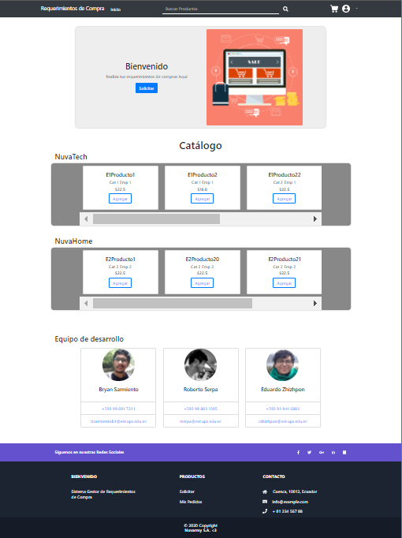
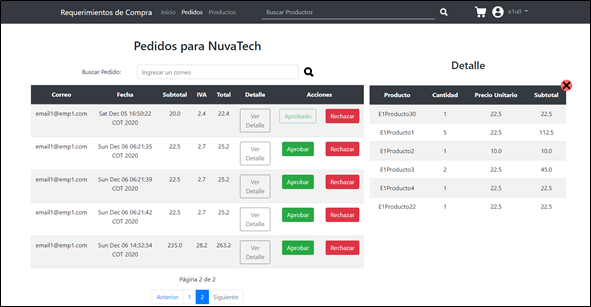

# Practica 01 - Desarollo de una Aplicación Web con JDBC y DAO.

Práctica de Plataformas Web en donde se aplican conocimientos de programación hipermedial aplicado al desarrollo de aplicaciones web usando distintos patrones de diseño.

**PRÁCTICA DE LABORATORIO**

**CARRERA** : Computación

**ASIGNATURA** : Plataformas Web

**TÍTULO PRÁCTICA** : Desarrollo de una aplicación JEE basado en Servlets, JSP y JDBC para el intercambio de datos en un modelo de tres capas aplicando los patrones diseño de software MVC y DAO.

**OBJETIVOS ALCANZADOS** :

> - Diseñar y desarrollar modelos de software en diferentes niveles de abstracción y modelos de datos a nivel transaccional y analítico con entornos de desarrollo actuales.

**ACTIVIDADES DESARROLLADAS**

<h3><strong>1. Considerar los requerimientos del sistema para el desarrollo del mismo. </strong></h3>

**Objetivo del sistema:** Permitir que un usuario registre requerimientos de compra, además de ver el estado de la misma, habiendo previamente iniciado sesión en el sistema.

**Reglas de negocio:**

> - Un usuario puede pertenecer a una sola empresa.
> - Una empresa cuenta con varios productos, los cuales están organizados por categorías.
> - Un producto puede pertenecer solo a una categoría.

**Requerimientos funcionales:**

1)	**[RF-1]** La aplicación deberá manejar dos roles: “Usuario” y “Administrador”.

2)	**[RF-2]** Un “Usuario” y “Administrador” pueden iniciar sesión usando su correo y contraseña.

3)	Una vez iniciado sesión el “Usuario” podrá:
> - **[RF-3]** Registrar, modificar, eliminar, buscar y listar sus requerimientos de compra.

4)	Una vez iniciado sesión el “Administrador” podrá:

> - **[RF-4]** Registrar, modificar, eliminar, buscar y listar los productos de su empresa.
> - **[RF-5]** Listar todos los requerimientos de compra de los “Usuarios” de su empresa.
> - **[RF-6]** Aprobar o rechazar los requerimientos de compra de los “Usuarios” de su empresa.

**Requerimientos no funcionales:**

1)	**[RNF-SEG-1]** El sistema deberá manejar sesiones y filtros.

2)	**[RNF-SEG-2]** El sistema deberá manejar una parte pública (index.html) y otra privada (RF).

3)	**[RNF-DIS-1]** El sistema debe aplicar los patrones de diseño MVC y DAO.

> - **Modelo:** Clases POJOs de Java.
> - **Vista:** JSP + JSTL.
> - **Controlador:** Servlets y DAOs.

4) **[RNF-BD-1]** La persistencia de datos deberá ser a través de JDBC.

5)	**[RNF-USA-1]** El sistema, en su parte pública presentará un catálogo de productos filtrados por empresa.

6)	**[RNF-USA-2]** Las páginas del sistema deben contar con una experiencia e interfaz de usuario apropiada.

**Nota:** Los productos serán filtrados por la empresa a la cual pertenecen.

<h3><strong>2. Desarrollar una aplicación con tecnología JEE para gestionar requerimientos de compra en la web. </strong></h3>

**Herramientas utilizadas:**
> - **IDE:** Eclipse
> - **JDK:** v11.09
> - **SGBD:** MariaDB, **Nombre de la BD:** sgrc
> - **SVR de aplicaciones:** Tomcat
> - •	**Otros:** jQuery, jQuery Validation Plugin, Bootstrap, Font Awesome

El desarrollo de la aplicación web se ha realizado siguiendo las recomendaciones y requerimientos planteados. Para tener una mejor organización se ha divido el modelo y controlador en 7 paquetes de acuerdo a su contenido: controller, dao, filter, model, jdbc, resources y test.

En el paquete controller, se encuentran los Servlets que realizan las funciones CRUD y List para cada uno de los modelos que se pudieron abstraer durante el análisis de los requerimientos. En el paquete model se encuentran los POJOs, los cuales son: Product, User, Company, Category, Bill Head y Bill Detail. 
Para la persistencia de datos, las interfaces y clases se encuentran distribuidas en los paquetes dao y mysql.jdbc. Además, para poder manejar la seguridad y control de acceso a las funcionalidades se crearon filtros, los cuales se encuentran en el paquete filter. 
Adicionalmente, para comprobar el funcionamiento de la conexión con la base de datos, e ir probando las funcionalidades se creó el paquete test para crear clases de prueba.  Finalmente, en el paquete resources se encuentran clases que complementan al proyecto, como la parametrización y los cálculos matemáticos.

Así mismo, para la parte de la vista se ha organizado por carpetas dependiendo del tipo de archivo, esto incluye las hojas de estilos, las imágenes e íconos además de las funciones de JavaScript. Cabe resaltar que se han divido las páginas JSP en dos: la parte pública y la privada.

Tal como se planteó en los requerimientos, la parte pública es una página que muestra una vista general del sistema, en la cual, se presentan los catálogos de productos por empresa. Como requerimientos se pide que se piense en la experiencia de usuario, por lo que se optó por realizar un diseño moderno y minimalista a través del framework de Bootstrap. Como resultado se obtuvo un sitio web basado en la plantilla de ejemplo presentada en la Ilustración 1. 

Por requerimientos, para ingresar a las funcionalidades del sistema, se deberá realizarlos a través de un inicio de sesión, diferenciando:  Administradores y Usuarios. Para ello se aplican los filtros mediante el uso de sesiones para lograr este requisito de seguridad; que, en caso de no cumplirlos, redirigirá al usuario de nuevo hacia la página de Log in.
A continuación, se puede ver tanto la página web en donde se realiza este proceso, como el código de los filtros que actúan de manera interna en el sistema.

**Parte de la Vista:**

**Parte del Controlador:**

Para los requerimientos de un “Usuario”, se solicitaba que pueda realizar un CRUD acerca de los requerimientos de compra (pedidos). Además, de listar los que ha realizado y mostrar el estado. Para ello se ha pensado en tres páginas exclusivas del mismo.
La primera, es donde podrá explorar los productos que se encuentran disponibles en la empresa a la que está afiliado. En esta, se listan todos los productos junto con una breve descripción de las características que posee. La misma cuenta con una barra de búsqueda y navegación a través de una paginación. Es aquí en donde se van escogiendo los productos que se quieren agregar al carrito de compras.

Una vez que el usuario haya agregado todos los productos que haya visto convenientes, podrá dirigirse a la segunda página exclusiva, la del carrito de compras. Esta página contiene la lista de los productos que ha agregado, además podrá cambiar la cantidad que requiere, eliminarlos o regresar al explorador. Además, se presenta la cantidad de dinero total que resultará de aquel requerimiento de compra. 

La tercera y última página, es aquella que muestra una lista de los pedidos ya realizados a la empresa. En la misma, se presenta la fecha del pedido, el total, además del estado actual del requerimiento de compra: “Pendiente”, “Aprobado” o “Rechazado”.

Para la parte de los requerimientos del “Administrador”, se solicitaba que este pudiera realizar un CRUD, y una lista de todos los productos de su empresa. Para ello se optó por diseñar una página que permita realizar todas las funciones en el mismo lugar.

**Vista de la Gestión de Productos:**

Como se aprecia en la Ilustración 11, en la parte izquierda se presentan los campos para crear otro nuevo producto en esa empresa y a qué categoría pertenecerá dicho producto. En la parte derecha de la página se presenta una lista paginada de los productos ya registrados en el sistema. Además, en la tabla también se presentan dos botones, uno que permitirá editar los datos del producto elegido, así como otro que permite eliminar (de manera lógica) o restaurar el mismo.

**Vista de los Requerimientos de Compra:**

Otro de los requerimientos funcionales de los administradores es la capacidad para aprobar o rechazar los pedidos que se hayan realizado para su empresa. Para ello, se creó otra página en donde se listan los pedidos pendientes también a través de una paginación. En esta página además se puede ver el detalle de los pedidos realizados.

Para la parte de la persistencia de datos, se ha solicitado que se realice mediante el uso del patrón DAO, en conjunto con JDBC (Java Database Connectivity). Esta API es básicamente una colección de métodos e interfaces mediante las cuales se puede gestionar las conexiones y transacciones con la base de datos a través del lenguaje SQL de la misma.

Para ello, se crearon métodos CRUD para cada entidad abstraída de los requerimientos, en donde se persiste y se abstrae la información en base a consultas SQL. Nota: Se elimina de manera lógica, no física.

A fin de evaluar el sistema desarrollado, se creó la clase “CreateTables” en el paquete de test, la cual inserta los datos necesarios en la BD, para realizar las pruebas correspondientes dentro de la aplicación web.

**RESULTADO(S) OBTENIDO(S)**:

> - Se logró manejar diferentes formatos para el intercambio de datos entre aplicaciones.
> - Se logró implementar un sistema web aplicando diferentes tipos de patrones de diseño orientados a negocios.
> - Se logró comprender ciertos aspectos acerca de la importancia del uso de patrones de diseño para la persistencia de datos.

**CONCLUSIONES** :

> - El uso de páginas JSP, junto con la librería JSTL permite al sistema tener una mayor flexibilidad ya que puede manipular las consultas SQL, realizar iteraciones, aplicar condiciones, entre otros.
> - El uso del patrón DAO, para la persistencia de datos permite que se separe la lógica de negocio con la parte de la lógica de acceso a los datos. Además, permite que el sistema obtenga datos desde varias fuentes sin gran dificultad.

**RECOMENDACIONES** :

> - Aplicar buenas prácticas de programación y diseño.
> - Aplicar conceptos de HCI para el desarrollo de la GUI.
> - Haber asistido a las sesiones de clase.
> - Realizar las preguntas respectivas al docente encargado.
> - Revisar el contenido teórico del tema, además de bibliografía pertinente.

**Estudiantes:** 

- Sarmiento Douglas Bryan Sarmiento.
- Serpa Pulgarin Roberto Carlos
- Zhizhpon Tacuri Cesar Eduardo 
